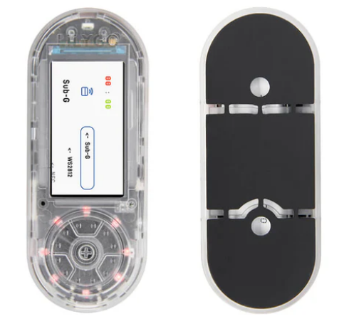
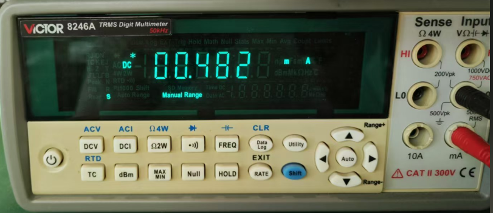
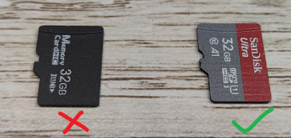

<h1 align = "center">🏆T-Embed-CC1101🏆</h1>

* [切换到中文](./README_CN.md)

 
  
  
  

## :zero: Version 🎁

### 1、Latest version
- Software : v1.1-250109
- Hardware : v1.0-240729

### 2、Where to buy.
[LilyGo Store](https://www.lilygo.cc/products/t-embed-cc1101)

## :one: Product 🎁

Video about T-Embed-CC1101 :  [youtube](https://www.youtube.com/watch?v=U06XI1wtp4U) 

|     Product      | [T-Embed-CC1101 ](https://www.lilygo.cc/products/t-embed-cc1101) |
| :--------------: | :--------------------------------------------------------------: |
|       MCU        |                         ESP32-S3-WROOM-1                         |
|  Flash / PSRAM   |                             16M / 8M                             |
|      Sub-G       |                              CC1101                              |
|       NFC        |                           PN532 (0x24)                           |
|    Display IC    |                         ST7789 (320x170)                         |
| Battery Capacity |                           3.7V-1300mAh                           |
|   Battery Chip   |                  BQ25896 (0x6B), BQ27220 (0x55)                  |
|    LED Driver    |                              WS2812                              |

➡ Some interesting projects that support T-Embed-CC1101：
|       name       |                                                      code                                                       |                                                                       web                                                                        |
| :--------------: | :-------------------------------------------------------------------------------------------------------------: | :----------------------------------------------------------------------------------------------------------------------------------------------: |
|      Bruce       |        [github](https://github.com/pr3y/Bruce/tree/WebPage "https://github.com/pr3y/Bruce/tree/WebPage")        |                                 [web](https://bruce.computer/flasher.html "https://bruce.computer/flasher.html")                                 |
|     Launcher     | [github](https://github.com/bmorcelli/M5Stick-Launcher.git "https://github.com/bmorcelli/M5Stick-Launcher.git") |            [web](https://bmorcelli.github.io/M5Stick-Launcher/flash0.html "https://bmorcelli.github.io/M5Stick-Launcher/flash0.html")            |
|   CapibaraZero   |            [github](https://github.com/CapibaraZero/fw.git "https://github.com/CapibaraZero/fw.git")            | [web](https://capibarazero.com/docs/esp32_s3/boards/LilyGo_T_Embed_CC1101 "https://capibarazero.com/docs/esp32_s3/boards/LilyGo_T_Embed_CC1101") |
| ESP32 Bus Pirate |                              [github](https://github.com/geo-tp/ESP32-Bus-Pirate)                               |                                                                       ---                                                                        |
## :two: Module 🎁

Datasheets on the chip are available in [./hardware](./hardware/) directory.

|   Name   |                                     Dependency library                                      |
| :------: | :-----------------------------------------------------------------------------------------: |
|  CC1101  |                [jgromes/RadioLib@6.5.0](https://github.com/jgromes/RadioLib)                |
|  PN532   |                          https://github.com/Seeed-Studio/PN532.git                          |
| BQ25896  |            [lewisxhe/XPowersLib@^0.2.3](https://github.com/lewisxhe/XPowersLib)             |
|  ST7789  |                [bodmer/TFT_eSPI@^2.5.43](https://github.com/Bodmer/TFT_eSPI)                |
|  Encode  | [mathertel/RotaryEncoder@^1.5.3](http://www.mathertel.de/Arduino/RotaryEncoderLibrary.aspx) |
|  WS2812  |                [fastled/FastLED@^3.9.12](https://github.com/FastLED/FastLED)                |
| Infrared |   [crankyoldgit/IRremoteESP8266@^2.8.6](https://github.com/crankyoldgit/IRremoteESP8266)    |
|  Audio   |       [esphome/ESP32-audioI2S@2.0.0](https://github.com/schreibfaul1/ESP32-audioI2S)        |
|   LVGL   |               [lvgl/lvgl@^8.3.11](https://github.com/lvgl/lvgl/tree/v8.3.11)                |
### 1、Wireless transceiver：

T-Embed-CC1101 has a built-in Sub-GHz module based on a `CC1101` transceiver and a radio antenna (the maximum range is 50 meters).  Both the CC1101 chip and the antenna are designed to operate at frequencies in the 300-348 MHz, 387-464 MHz, and 779-928 MHz bands.

The Sub-GHz application supports external radio modules based on the CC1101 transceiver.

### 2、PN532

The PN532 only supports high-frequency cards at 13.56MHz, does not support low-frequency cards at 125K, does not support CPU cards, and does not support encryption cards.

"✅" represents a card of support.
|       **Type**       |       **Encryption Method**       | **Anti-Copy Capability** |                               **Attack Risk**                               |                              Typical uses                              |
| :------------------: | :-------------------------------: | :----------------------: | :-------------------------------------------------------------------------: | :--------------------------------------------------------------------: |
| **Mifare Classic** ✅ | Weak (CRYPTO1 algorithm, cracked) |           Low            |                  Easily cloned (e.g., via Proxmark3 tools)                  |     Access control cards, public transportation cards (old system)     |
|     **NTAG**  ✅      |   No encryption (UID lockable)    |         Very Low         |                        Data can be arbitrarily read                         | Smart labels, advertising interaction, and product anti-counterfeiting |
|   **Mifare Plus**    |        AES-128 encryption         |       Medium-High        |                      Requires physical access to crack                      |                                   -                                    |
|      **Felica**      |  Dynamic encryption (SAM module)  |           High           |                  Hard to crack (Japan-exclusive protocol)                   |           Japanese transportation cards, electronic wallets            |
|     **DESFire**      |        AES/TDES encryption        |        Very High         |         Supports multi-app isolation, resists side-channel attacks          |   High-security access control, campus one-card, electronic passport   |
|     **CPU Card**     | Hardware encryption (SM4/ECC/RSA) |        Very High         | Supports China's national cryptographic standards, financial-grade security |                Bank card, ID card, social security card                |

## :three: Quick Start 🎁

🟢 PlatformIO is recommended because these examples were developed on it. 🟢 

### 1、PlatformIO

1. Install [Visual Studio Code](https://code.visualstudio.com/) and [Python](https://www.python.org/), and clone or download the project;
2. Search for the `PlatformIO` plugin in the `VisualStudioCode` extension and install it;
3. After the installation is complete, you need to restart `VisualStudioCode`
4. After opening this project, PlatformIO will automatically download the required tripartite libraries and dependencies, the first time this process is relatively long, please wait patiently;
5. After all the dependencies are installed, you can open the `platformio.ini` configuration file, uncomment in `example` to select a routine, and then press `ctrl+s` to save the `.ini` configuration file;
6. Click :ballot_box_with_check: under VScode to compile the project, then plug in USB and select COM under VScode;
7. Finally, click the :arrow_right:  button to download the program to Flash;

### 2、Arduino IDE

1. Install [Arduino IDE](https://www.arduino.cc/en/software)

2. Copy all files under `this project/lib/` and paste them into the Arduion library path (generally `C:\Users\YourName\Documents\Arduino\libraries`);

3. Open the Arduion IDE and click `File->Open` in the upper left corner to open an example in `this project/example/xxx/xxx.ino` under this item;

4. Then configure Arduion. After the configuration is completed in the following way, you can click the button in the upper left corner of Arduion to compile and download;

| Arduino IDE Setting                  | Value                             |
| ------------------------------------ | --------------------------------- |
| Board                                | **ESP32S3 Dev Module**            |
| Port                                 | Your port                         |
| USB CDC On Boot                      | Enable                            |
| CPU Frequency                        | 240MHZ(WiFi)                      |
| Core Debug Level                     | None                              |
| USB DFU On Boot                      | Disable                           |
| Erase All Flash Before Sketch Upload | Disable                           |
| Events Run On                        | Core1                             |
| Flash Mode                           | QIO 80MHZ                         |
| Flash Size                           | **16MB(128Mb)**                   |
| Arduino Runs On                      | Core1                             |
| USB Firmware MSC On Boot             | Disable                           |
| Partition Scheme                     | **16M Flash(3M APP/9.9MB FATFS)** |
| PSRAM                                | **OPI PSRAM**                     |
| Upload Mode                          | **UART0/Hardware CDC**            |
| Upload Speed                         | 921600                            |
| USB Mode                             | **CDC and JTAG**                  |

### 3、Folder structure:
~~~
├─3D_files: Store 3D structure files
├─boards  : Some information about the board for the platformio.ini configuration project;
├─data    : Picture resources used by the program;
├─example : Some examples;
├─firmare : `factory` compiled firmware;
├─hardware: Schematic diagram of the board, chip data;
├─lib     : Libraries used in the project;
~~~

### 4、Examples

~~~
- ✅ bq27xxx_test : BQ27220 test.
- ✅ bq25896_test : Battery management test. Print the battery status in the serial port.
- ✅ cc1101_recv_irq ：Wireless reception test, display received messages in the serial port.
- ✅ cc1101_send_irq ：Wireless sending test, display sent messages in the serial port.
- ✅ display_test ：Screen display test;
- ✅ encode_test ：encoder tester
- ✅ factory_test ：Factory programs can currently only be compiled and downloaded on PlatformIO;
- ✅ infrared_recv_test: Infrared test
- ✅ infrared_send_test: Infrared test
- ✅ lvgl_test ：lvgl benchmark and stress testing;
- ✅ pn532_test ：NFC test, display the IC card information in the serial port.
- ✅ tf_card_test ：SD card test, the file name is displayed in the serial port.
- ✅ record_test : Record 15 seconds of audio and save it to your SD card.
- ✅ voice_test : Loudspeaker test, read audio from SPIFFS.
- ✅ ws2812_test ：LED light test;
~~~

## :four: Pins 🎁

~~~c
#define BOARD_USER_KEY 6
#define BOARD_PWR_EN   15

// WS2812
#define WS2812_NUM_LEDS 8
#define WS2812_DATA_PIN 14

// IR
#define BOARD_IR_EN 2
#define BOARD_IR_RX 1

// MIC
#define BOARD_MIC_DATA 42
#define BOARD_MIC_CLK  39

// VOICE
#define BOARD_VOICE_BCLK  46
#define BOARD_VOICE_LRCLK 40
#define BOARD_VOICE_DIN   7

// --------- DISPLAY ---------
// About LCD definition in the file: lib/TFT_eSPI/User_Setups/Setup214_LilyGo_T_Embed_PN532.h
#define DISPLAY_WIDTH  170
#define DISPLAY_HEIGHT 320

#define DISPLAY_BL   21 
#define DISPLAY_CS   41
#define DISPLAY_MISO -1
#define DISPLAY_MOSI  9
#define DISPLAY_SCLK 11
#define DISPLAY_DC   16
#define DISPLAY_RST  40

// --------- ENCODER ---------
#define ENCODER_INA 4
#define ENCODER_INB 5
#define ENCODER_KEY 0

// --------- IIC ---------
#define BOARD_I2C_SDA  8
#define BOARD_I2C_SCL  18

// IIC addr
#define BOARD_I2C_ADDR_1 0x24  // PN532
#define BOARD_I2C_ADDR_2 0x55  // BQ27220
#define BOARD_I2C_ADDR_3 0x6b  // BQ25896

// NFC
#define BOARD_PN532_SCL     BOARD_I2C_SCL
#define BOARD_PN532_SDA     BOARD_I2C_SDA
#define BOARD_PN532_RF_REST 45
#define BOARD_PN532_IRQ     17

// --------- SPI ---------
#define BOARD_SPI_SCK  11
#define BOARD_SPI_MOSI 9
#define BOARD_SPI_MISO 10

// TF card
#define BOARD_SD_CS   13
#define BOARD_SD_SCK  BOARD_SPI_SCK
#define BOARD_SD_MOSI BOARD_SPI_MOSI
#define BOARD_SD_MISO BOARD_SPI_MISO

// LORA
#define BOARD_LORA_CS   12
#define BOARD_LORA_SCK  BOARD_SPI_SCK
#define BOARD_LORA_MOSI BOARD_SPI_MOSI
#define BOARD_LORA_MISO BOARD_SPI_MISO
#define BOARD_LORA_IO2  38
#define BOARD_LORA_IO0  3
#define BOARD_LORA_SW1  47
#define BOARD_LORA_SW0  48
~~~

### Extension interface

## :five: Test 🎁

Sleep power consumption.

## :six: FAQ 🎁

### Unable to detect sd card：
We were able to successfully test SD with SanDisk no larger than 32GB; But some other cards don't, and it's not clear why;

Therefore, when the SD card is not detected, it is recommended to change a SanDisk card not larger than 32G;

### Other questions

|                       Problem                       |                                  Link                                  |
| :-------------------------------------------------: | :--------------------------------------------------------------------: |
|            How do I enter download mode?            |                    [docs](./docs/download_mode.md)                     |
|            How to download the program?             |                 [dosc](./docs/flash_download_tool.md)                  |
|  How do I turn on the device after I shut it down?  | [Issues #5](https://github.com/Xinyuan-LilyGO/T-Embed-CC1101/issues/5) |
|      How do I configure Wifi with EspTouch?         | [Issues #4](https://github.com/Xinyuan-LilyGO/T-Embed-CC1101/issues/4) |
|            Why won't the battery charge？            | [Issues #9](https://github.com/Xinyuan-LilyGO/T-Embed-CC1101/issues/9) |

## :seven: Schematic & 3D 🎁

For more information, see the `./hardware` directory.

Schematic : [T-Embed-CC1101](./hardware/T-Embed-CC1101%20V1.0%2024-07-29.pdf)

CC1101 Schematic : [CC1101](./hardware/cc1101-shield.pdf)

CC1101 Pins : [CC1101 Pins](./hardware/CC1101_pin.png)

3D Files : [T-Embed CC1101.stp](./3D_files/T-Embed%20CC1101.stp)
