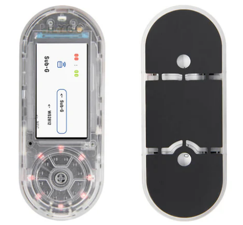
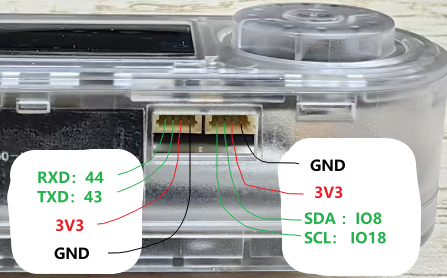

<h1 align = "center">🌟T-Embed-CC1101🌟</h1>

* [Switch to English](./README.md)

 
  
  
  

## :zero: 版本 🎁

### 1、最新版本
- Software : v1.1-250109
- Hardware : v1.0-240729

### 2、如何购买

## :one: Product 🎁

这里有一个关于 T-Embed-CC1101 的视屏:  [youtube](https://www.youtube.com/watch?v=U06XI1wtp4U) 

|     Product      | [T-Embed-CC1101 ](https://www.lilygo.cc/products/t-embed-cc1101) |
| :--------------: | :--------------------------------------------------------------: |
|       MCU        |                         ESP32-S3-WROOM-1                         |
|  Flash / PSRAM   |                             16M / 8M                             |
|      Sub-G       |                              CC1101                              |
|       NFC        |                           PN532 (0x24)                           |
|    Display IC    |                         ST7789 (320x170)                         |
| Battery Capacity |                           3.7V-1300mAh                           |
|   Battery Chip   |                  BQ25896 (0x6B), BQ27220 (0x55)                  |
|    LED Driver    |                              WS2812                              |

下面是一下关于 T-Embed-CC1101 的开源项目：

|     name     |                                                      code                                                       |                                                            web                                                             |
| :----------: | :-------------------------------------------------------------------------------------------------------------: | :------------------------------------------------------------------------------------------------------------------------: |
|    Bruce     |        [github](https://github.com/pr3y/Bruce/tree/WebPage "https://github.com/pr3y/Bruce/tree/WebPage")        |                      [web](https://bruce.computer/flasher.html "https://bruce.computer/flasher.html")                      |
|   Launcher   | [github](https://github.com/bmorcelli/M5Stick-Launcher.git "https://github.com/bmorcelli/M5Stick-Launcher.git") | [web](https://bmorcelli.github.io/M5Stick-Launcher/flash0.html "https://bmorcelli.github.io/M5Stick-Launcher/flash0.html") |
| CapibaraZero |            [github](https://github.com/CapibaraZero/fw.git "https://github.com/CapibaraZero/fw.git")            |                         [web](https://capibarazero.com/docs/esp32_s3/boards/LilyGo_T_Embed_CC1101)                         |

## :two: Module 🎁

硬件和芯片的资料都在 [./hardware](./hardware/) 目录下面；

下面是 T-Embed-CC1101 代码使用的一些库；

|   Name   |                                     Dependency library                                      |
| :------: | :-----------------------------------------------------------------------------------------: |
|  CC1101  |                [jgromes/RadioLib@6.5.0](https://github.com/jgromes/RadioLib)                |
|  PN532   |                          https://github.com/Seeed-Studio/PN532.git                          |
| BQ25896  |            [lewisxhe/XPowersLib@^0.2.3](https://github.com/lewisxhe/XPowersLib)             |
|  ST7789  |                [bodmer/TFT_eSPI@^2.5.43](https://github.com/Bodmer/TFT_eSPI)                |
|  Encode  | [mathertel/RotaryEncoder@^1.5.3](http://www.mathertel.de/Arduino/RotaryEncoderLibrary.aspx) |
|  WS2812  |                [fastled/FastLED@^3.9.12](https://github.com/FastLED/FastLED)                |
| Infrared |   [crankyoldgit/IRremoteESP8266@^2.8.6](https://github.com/crankyoldgit/IRremoteESP8266)    |
|  Audio   |       [esphome/ESP32-audioI2S@2.0.0](https://github.com/schreibfaul1/ESP32-audioI2S)        |
|   LVGL   |               [lvgl/lvgl@^8.3.11](https://github.com/lvgl/lvgl/tree/v8.3.11)                |

### 1、CC1101 模块：

t- embedded -CC1101有一个内置的Sub-GHz模块，基于“CC1101”收发器和无线电天线（最大距离为50米）。CC1101芯片和天线都设计在300-348 MHz、387-464 MHz和779-928 MHz频段工作。

Sub-GHz应用支持基于CC1101收发器的外部无线电模块。

### 2、PN532 (NFC)

PN532是一个高度集成的收发模块，用于13.56 MHz的非接触式通信，基于80C51微控制器核心。支持6种不同的工作模式：
- ISO/IEC 14443A/MIFARE Reader/Writer
- FeliCa Reader/Writer
- ISO/IEC 14443B Reader/Writer
- ISO/IEC 14443A/MIFARE Card MIFARE Classic 1K or MIFARE Classic 4K card emulation mode
- FeliCa Card emulation
- ISO/IEC 18092, ECMA 340 Peer-to-Peer

支持卡的类型有 14443A 

如果不知道自己的NFC卡是什么类型的，可以在手机上使用 [NFC tools](./hardware/tool/nfc-tools-8-12.apk) 工具，读一下就知道了；

## :three: 快速开始

### 1、PlatformIO

 提示：下面一个是安装的流程，更详细的安装，可以使用浏览器搜索 PlatformIO 的安装教程；例如：[PlatformIO 环境安装](https://zhuanlan.zhihu.com/p/509527710)

1. 安装 [VScode]((https://code.visualstudio.com/)) 和 [Python](https://www.python.org/)，并且克隆或下载此项目；
2. 在 VScode 的扩展中搜索 PlatformIO 的插件，然后安装它；
3. 在 PlatformIO 插件安装完成后，需要重新启动 VScode，然后用 VScode 打开此工程；
4. 打开此工程后，PlatformIO 会自动的下载需要的三方库和依赖，第一次这个过程比较长，情耐心等待；
5. 当所有的依赖安装后，可以打开 `platformio.ini` 配置文件，在 `example` 中取消注释来选择一个例程，选择后按下 `ctrl+s` 保存 .ini 配置文件；
6. 点击 VScode 下面的 :ballot_box_with_check: 编译工程，然后插上 USB 在 VScode 下面选择 COM 口；
7. 最后点击 :arrow_right: 按键将程序下载到 Flash 中；

### 2、Arduino IDE

:exclamation: :exclamation: :exclamation: 注意：我们更推荐使用 PlatformIO，使用 Arduion 可能编译不通过，可以参考 **2️⃣-Example** 查看那些例子是在 Arduion 环境测试编译成功的。

1. 安装 [Arduino IDE](https://www.arduino.cc/en/software)，并且克隆或下载此项目；
2. 安装 esp32 的工具包，打开 Arduion IDE，点击打开 `File->Perferences`，然后将 `https://espressif.github.io/arduino-esp32/package_esp32_index.json` 粘贴到如下图的位置，然后点击 :ok:，等待工具包下载完成；

3. 复制 `此项目/lib/` 下的所有文件，并且粘贴到 Arduion 的库路径(一般是 `C:\Users\YourName\Documents\Arduino\libraries`)下面；
4. 打开 Arduion IDE，点击左上角 `File->Open` 打开 `此项目下/example/xxx/xxx.ino` 中的一个例子；
5. 然后配置 Arduion，按照下面的方式配置完成后，就可以点击 Arduion 左上角按键进行编译下载了；

| Arduino IDE Setting                  | Value                             |
| ------------------------------------ | --------------------------------- |
| Board                                | **ESP32S3 Dev Module**            |
| Port                                 | Your port                         |
| USB CDC On Boot                      | Enable                            |
| CPU Frequency                        | 240MHZ(WiFi)                      |
| Core Debug Level                     | None                              |
| USB DFU On Boot                      | Disable                           |
| Erase All Flash Before Sketch Upload | Disable                           |
| Events Run On                        | Core1                             |
| Flash Mode                           | QIO 80MHZ                         |
| Flash Size                           | **16MB(128Mb)**                   |
| Arduino Runs On                      | Core1                             |
| USB Firmware MSC On Boot             | Disable                           |
| Partition Scheme                     | **16M Flash(3M APP/9.9MB FATFS)** |
| PSRAM                                | **OPI PSRAM**                     |
| Upload Mode                          | **UART0/Hardware CDC**            |
| Upload Speed                         | 921600                            |
| USB Mode                             | **CDC and JTAG**                  |

### 3、文件夹结构
~~~
├─3D_files: 存放3D结构文件
├─boards  : 板子的一些信息，用于 platformio.ini 配置工程；
├─data    : 程序用到的图片资源；
├─example : 一些例子；
├─firmare : `factory` 编译生成的固件；
├─hardware: 板子的原理图、芯片资料；
├─lib     : 项目中用到的库；
~~~

### 4、例程

~~~
- ✅ bq25896_test : 电池管理测试，在串口中打印电池状态。
- ✅ cc1101_recv_irq ：无线接收测试，在串口中显示接收到的消息。
- ✅ cc1101_send_irq ：无线发送测试，在串口中显示发送的消息。
- ✅ display_test ：屏幕显示测试；
- ✅ encode_test ：编码器测试。
- ✅ infrared_recv_test: 红外接收
- ✅ infrared_send_test: 红外发送
- ✅ lvgl_test ：lvgl benchmark 和压力测试；
- ✅ pn532_test ：NFC测试，在串口中显示 IC 卡的信息。
- ✅ tf_card_test ：SD 卡测试，在串口中显示读取到的的文件名。
- ✅ record_test : 录制 15 秒钟的音频，并保存到 SD 卡中。
- ✅ voice_test : 扬声器测试，从SD卡读取音频。
- ✅ ws2812_test ：LED 灯测试；
~~~

## :four: 引脚 🎁

~~~c
#define BOARD_USER_KEY 6
#define BOARD_PWR_EN   15

// WS2812
#define WS2812_NUM_LEDS 8
#define WS2812_DATA_PIN 14

// IR
#define BOARD_IR_EN 2
#define BOARD_IR_RX 1

// MIC
#define BOARD_MIC_DATA 42
#define BOARD_MIC_CLK  39

// VOICE
#define BOARD_VOICE_BCLK  46
#define BOARD_VOICE_LRCLK 40
#define BOARD_VOICE_DIN   7

// --------- DISPLAY ---------
// About LCD definition in the file: lib/TFT_eSPI/User_Setups/Setup214_LilyGo_T_Embed_PN532.h
#define DISPLAY_WIDTH  170
#define DISPLAY_HEIGHT 320

#define DISPLAY_BL   21 
#define DISPLAY_CS   41
#define DISPLAY_MISO -1
#define DISPLAY_MOSI  9
#define DISPLAY_SCLK 11
#define DISPLAY_DC   16
#define DISPLAY_RST  40

// --------- ENCODER ---------
#define ENCODER_INA 4
#define ENCODER_INB 5
#define ENCODER_KEY 0

// --------- IIC ---------
#define BOARD_I2C_SDA  8
#define BOARD_I2C_SCL  18

// IIC addr
#define BOARD_I2C_ADDR_1 0x24  // PN532
#define BOARD_I2C_ADDR_2 0x55  // BQ27220
#define BOARD_I2C_ADDR_3 0x6b  // BQ25896

// NFC
#define BOARD_PN532_SCL     BOARD_I2C_SCL
#define BOARD_PN532_SDA     BOARD_I2C_SDA
#define BOARD_PN532_RF_REST 45
#define BOARD_PN532_IRQ     17

// --------- SPI ---------
#define BOARD_SPI_SCK  11
#define BOARD_SPI_MOSI 9
#define BOARD_SPI_MISO 10

// TF card
#define BOARD_SD_CS   13
#define BOARD_SD_SCK  BOARD_SPI_SCK
#define BOARD_SD_MOSI BOARD_SPI_MOSI
#define BOARD_SD_MISO BOARD_SPI_MISO

// LORA
#define BOARD_LORA_CS   12
#define BOARD_LORA_SCK  BOARD_SPI_SCK
#define BOARD_LORA_MOSI BOARD_SPI_MOSI
#define BOARD_LORA_MISO BOARD_SPI_MISO
#define BOARD_LORA_IO2  38
#define BOARD_LORA_IO0  3
#define BOARD_LORA_SW1  47
#define BOARD_LORA_SW0  48
~~~

### 扩展接口

## :five: 测试 🎁

睡眠功耗

## :six: FAQ 🎁

### 不能检测到SD的问题：

我们用SanDisk成功测试了不超过32GB的SD；但其他一些卡片没有，原因尚不清楚；

因此，在未检测到SD卡的情况下，建议更换不大于32G的 SanDisk 卡；

### 其他问题

|                       Problem                       |                                  Link                                  |
| :-------------------------------------------------: | :--------------------------------------------------------------------: |
|            How do I enter download mode?            |                    [docs](./docs/download_mode.md)                     |
|            How to download the program?             |                 [dosc](./docs/flash_download_tool.md)                  |
|  How do I turn on the device after I shut it down?  | [Issues #5](https://github.com/Xinyuan-LilyGO/T-Embed-CC1101/issues/5) |
|      How do I configure Wifi with EspTouch?         | [Issues #4](https://github.com/Xinyuan-LilyGO/T-Embed-CC1101/issues/4) |
|            Why won't the battery charge？            | [Issues #9](https://github.com/Xinyuan-LilyGO/T-Embed-CC1101/issues/9) |

## :seven: 原理图 & 3D文件 🎁

For more information, see the `./hardware` directory.

Schematic : [T-Embed-CC1101](./hardware/T-Embed-CC1101%20V1.0%2024-07-29.pdf)

CC1101 Schematic : [CC1101](./hardware/cc1101-shield.pdf)

CC1101 Pins : [CC1101 Pins](./hardware/CC1101_pin.png)

3D Files : [T-Embed CC1101.stp](./3D_files/T-Embed%20CC1101.stp)

