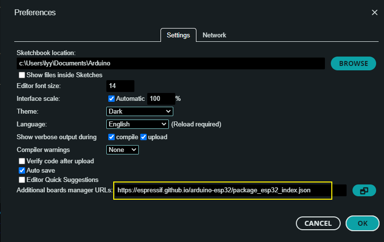
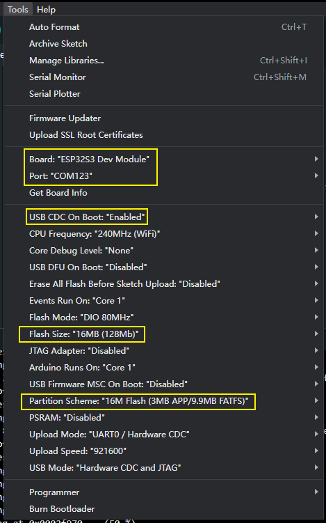

<h1 align = "center">🌟T-Embed-PN532🌟</h1>

* [切换到中文版](./README_CN.md)

## :one:Product

| Version |   v1.0 24-03-15   |
|:-------:|:-----------------:|
| Module  | ESP32-S3-WROOM-1U |
|  Flash  |       16MB        |
|  PSRAM  |        8MB        |
| Screen  |      320x170      |

## :two: Example

Some examples are provided under the Project example folder, which can run on PlatformIO (PIO) and Arduion, but I prefer to use PIO because these examples are developed on PIO, ** All examples can run on PIO **, However, you may encounter compilation errors on Arduion, but don't worry, the author will step up to test the compilation of Arduion environment.

Examples of compilation in Arduion environment:
- [x] audio_test : Record 15 seconds of audio and save it to your SD card.
- [x] bq25896_test : Battery management test. Print the battery status in the serial port.
- [x] cc1101_recv_irq ：Wireless reception test, display received messages in the serial port.
- [x] cc1101_send_irq ：Wireless sending test, display sent messages in the serial port.
- [x] display_test ：Screen display test;
- [x] encode_test ：encoder tester
- [ ] factory ：:exclamation::exclamation::exclamation: Factory programs can currently only be compiled and downloaded on PlatformIO;
- [x] infrared_test ：Infrared test. Displays the received infrared information in the serial port.
- [x] lvgl_test ：lvgl benchmark and stress testing;
- [x] pn532_test ：NFC test, display the IC card information in the serial port.
- [x] tf_card_test ：SD card test, the file name is displayed in the serial port.
- [x] ws2812_test ：LED light test;

## :three: PlatformIO 快速开始

1. Install [Visual Studio Code](https://code.visualstudio.com/) and [Python](https://www.python.org/), and clone or download the project;
2. Search for the `PlatformIO` plugin in the `VisualStudioCode` extension and install it;
3. After the installation is complete, you need to restart `VisualStudioCode`
4. After opening this project, PlatformIO will automatically download the required tripartite libraries and dependencies, the first time this process is relatively long, please wait patiently;
5. After all the dependencies are installed, you can open the `platformio.ini` configuration file, uncomment in `example` to select a routine, and then press `ctrl+s` to save the `.ini` configuration file;
6. Click [:ballot_box_with_check:] under VScode to compile the project, then plug in USB and select COM under VScode;
7. Finally, click the [:arrow_right:] button to download the program to Flash;

## :four: Arduion 快速开始

 **Notice:**
PlatformIO is more recommended because it may not be compiled with Arduion. You can refer to [example.](#2️⃣-example) to see which examples are successfully compiled in Arduion environment.

1. Install [Arduino IDE](https://www.arduino.cc/en/software)
2. Install the esp32 toolkit, open the Arduion IDE, click on `File->Perferences`, Then `https://espressif.github.io/arduino-esp32/package_esp32_index.json ` paste to the position of the diagram below, then click: ok:, waiting for the toolkit download is complete;

3. Copy all files under `this project/lib/` and paste them into the Arduion library path (generally `C:\Users\YourName\Documents\Arduino\libraries`);
4. Open the Arduion IDE and click `File->Open` in the upper left corner to open an example in `this project/example/xxx/xxx.ino` under this item;
5. Then configure Arduion. After the configuration is completed in the following way, you can click the button in the upper left corner of Arduion to compile and download;

## :five: Other
To be added...
