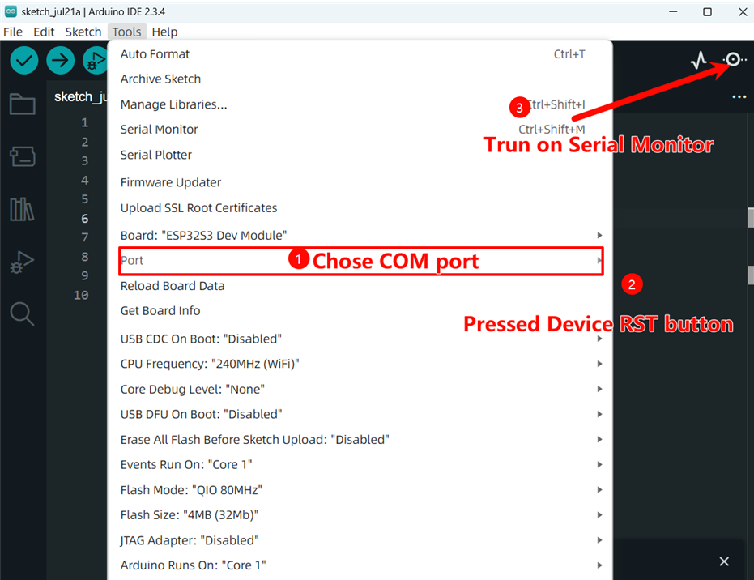

The issue of no display on the screen: 

屏幕没有显示的问题：

1. Rule out the possibility of no program installed; download the factory firmware to reset and see if it works normally.
 排除没有程序的问题；下载出厂固件复位，看能否正常工作；

2. If the screen still doesn't display after installing the program, remove the battery and only use USB power supply. Then unplug and plug in the USB to power on again. 如果有程序屏幕还是没有显示，就把电池拔掉，只使用USB供电，在插拔usb重新上电；

3. If the screen still doesn't display after completing the above two steps, it might be that the screen cable is loose. You can disassemble the device and reinsert the screen cable.如果做完上面两部屏幕还是不显示，可能是屏幕排线松了，可以把设备拆了，然后重新插一下屏幕排线；

What about the information after opening SerialMonitor? It's not the log for uploading the firmware. 
打开SerialMontor 之后的信息呢 ？不是要上传固件的日志

Open the back cover, press the button close to the ESP to reset. If it still doesn't work, try removing the battery and reinserting it.
打开背盖，按下靠近esp 的 按键进行复位，如果还是不行，试试拔掉电池，重新插上试试，