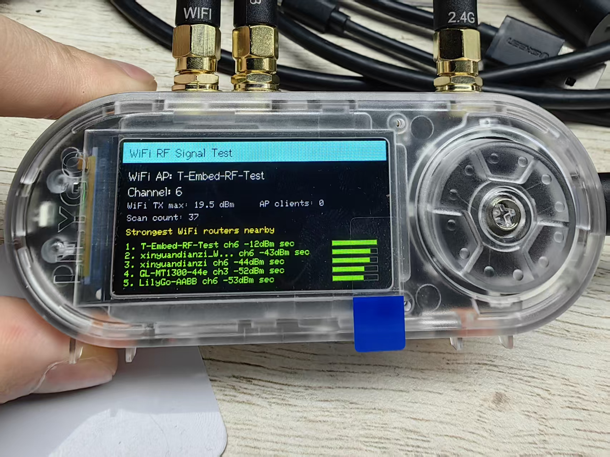

# Wi-Fi Signal Diagnostic Example

[English](./README.md) | [简体中文](./README_CN.md)

This example is a Wi-Fi-only diagnostic sketch for the external-antenna T-Embed CC1101 Plus. BLE is intentionally disabled so the customer can focus on Wi-Fi signal testing without restart issues caused by Wi-Fi/BLE coexistence.



## Features

- Starts a 2.4 GHz Wi-Fi AP named `T-Embed-RF-Test`, password `12345678`, so a phone can measure the signal transmitted by the device.
- Sets Wi-Fi max TX power to `19.5 dBm` and disables Wi-Fi sleep.
- Scans nearby routers every 10 seconds and prints RSSI in `dBm` on the screen and serial monitor.
- Shows the strongest nearby networks, AP client count, and current channel on the display.

## PlatformIO Steps

1. Install the external antenna before powering on the device.
2. Connect the device to the computer with USB.
3. Open `platformio.ini` in the repository root.
4. Make sure this line is enabled:

   ```ini
   src_dir = examples/wifi_ble_signal_test
   ```

5. Save `platformio.ini`.
6. Select the correct serial port in VSCode / PlatformIO.
7. Click the PlatformIO Upload button.
8. Open the serial monitor at `115200` baud.

## Customer Test Steps

1. Install a Wi-Fi analyzer app on a phone.
2. After flashing, the device screen should show `WiFi RF Signal Test`.
3. Use the phone Wi-Fi scanner to find `T-Embed-RF-Test`.
4. Record RSSI at `0.5 m`, `1.5 m`, and `3 m`.
5. Put the device near the router and record the router RSSI shown on the screen or serial monitor.
6. Send back screenshots and the serial log.

## RSSI Reference

- `-30 ~ -50 dBm`: very strong
- `-50 ~ -67 dBm`: normal
- `-67 ~ -75 dBm`: weak, but usually still usable
- `< -75 dBm`: poor signal

If Wi-Fi is still weak at close range with this sketch, check the external antenna, IPEX/U.FL connector, RF cable, antenna soldering, and assembly path first.
