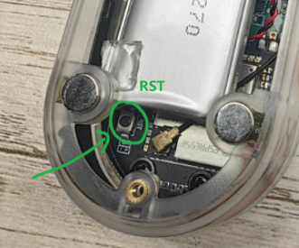

How to download the program? ->[dosc](../docs/flash_download_tool.md)

***Notice***: After the download is complete, if the screen does not light up, you need to press the `RST` key at the back;

---
There are also some firmware related to T-Embed-CC1101, which you can refer to via the link below.

|     name     |                                                      code                                                       |                                       web                                        |
| :----------: | :-------------------------------------------------------------------------------------------------------------: | :------------------------------------------------------------------------------: |
|    Bruce     |        [github](https://github.com/pr3y/Bruce/tree/WebPage "https://github.com/pr3y/Bruce/tree/WebPage")        | [web](https://bruce.computer/flasher.html "https://bruce.computer/flasher.html") |
|   Launcher   | [github](https://github.com/bmorcelli/M5Stick-Launcher.git "https://github.com/bmorcelli/M5Stick-Launcher.git") |             [web](https://bmorcelli.github.io/Launcher/catalog.html)             |
| CapibaraZero |            [github](https://github.com/CapibaraZero/fw.git "https://github.com/CapibaraZero/fw.git")            |    [web](https://capibarazero.com/docs/esp32_s3/boards/LilyGo_T_Embed_CC1101)    |